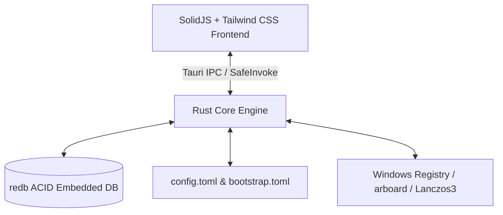

# TheBerry 🍓

<p align="center">
  <a href="https://BerryUIKI.github.io/TheBerry/"><strong>🌐 Visit Official Website (GitHub Pages)</strong></a>
  <br />
  <a href="README.md">English</a> | <a href="README_zh.md">简体中文</a>
</p>

<p align="center">
  <a href="https://BerryUIKI.github.io/TheBerry/"></a>
  <a href="https://github.com/BerryUIKI/TheBerry/actions/workflows/ci.yml"></a>
  <a href="https://github.com/BerryUIKI/TheBerry/actions/workflows/release.yml"></a>
  <a href="LICENSE"></a>
</p>

**TheBerry** is an ultra-fast, offline-first personal desktop productivity suite built with **Tauri v2 + Rust** on the backend and **SolidJS + TypeScript + Tailwind CSS** on the frontend.

---

## 🌟 Feature Suite

### 1. 🔍 Global Spotlight Quick-Launch HUD (`Ctrl + K`)
- Instant federated search across Launcher apps, Clipboard history, Code Snippets, and local Files.
- Dedicated category filter tags (`@app`, `@clip`, `@snip`, `@file`).
- Full keyboard workflow: `↑`/`↓` navigate, `Enter` activate, `Ctrl+C` copy path, `Ctrl+E` reveal in Explorer, `Esc` dismiss.

### 2. 📋 Rich Media Clipboard & redb Deep Search
- Background daemon capturing plain text, URLs, and image screenshots.
- Real-time base64 image thumbnails with fullscreen zoom viewer.
- Deep redb full-text search with content type (`text`, `image`, `url`, `json`) and pin filters.
- Batch selection and deletion mode.

### 3. 🚀 Application Launcher & Start Menu Discovery
- Automatic Windows Start Menu (`.lnk`) application discovery scanner.
- Custom arguments, working directories, and multi-command batch execution.

### 4. ⚡ Dynamic Code Snippets with Live Preview
- Placeholder template expansion: `${DATE}`, `${TIME}`, `${UUID}`, `${CLIPBOARD_TEXT}`.
- Real-time live evaluation preview card while writing snippets.
- JSON backup export and bulk import.

### 5. 🖼️ Lanczos3 Image Converter & Optimization Presets
- Batch image compression and format conversion across PNG, JPEG, and WebP.
- High-fidelity Lanczos3 scaling, aspect ratio preservation, and quality tuning.
- 4 One-click presets (`Web Optimized (WebP 80%)`, `Lossless (PNG)`, `Thumbnail (600px)`, `Mobile (1280px JPG)`).
- Byte reduction and storage savings percentage telemetry.

### 6. 📂 Disk-Speed File Search & QuickLook Preview
- Instant multi-drive file matching with substring keyword highlighting.
- Sortable table columns (Name, Size, Path) and 1-click Explorer reveal.
- Native Windows QuickLook spacebar file previews integrated into File Search, Spotlight, and Image Converter.

### 7. 🔄 Bi-Directional Folder Sync Engine
- High-performance folder synchronization with Two-way, Mirror, and Update modes.
- Comparison engine supporting Timestamp & Size or cryptographic Content Hash (SHA-256).
- Real-time filesystem change monitoring with configurable debouncing.
- Safe deletion handling via Recycle Bin, timestamped Versioning archives, or permanent removal.

### 8. 🧰 Full Developer & Productivity Toolbox (17/17 Complete Suite)
- **Image Compressor**: Deep multi-threaded image optimization with SIMD encoding, quality sliders, max dimension scaling, and byte savings telemetry.
- **Markdown & Rich Text Converter**: Bi-directional Markdown ➔ HTML ➔ Plain text conversions, live preview, and one-click rich text clipboard export for Word, Outlook, and WeChat.
- **Excel & CSV Sheet Converter**: Rapid conversion between XLSX, XLS, CSV, and TSV with paginated table viewer, multi-sheet workbook tabs, JSON export, and Excel-compatible UTF-8 BOM encoding.
- **PDF Organizer (Merge & Split)**: Combine multiple PDFs with custom reordering and per-file page ranges; extract and split pages by range into separate documents.
- **PDF to Images**: High-resolution page rendering (1x, 2x, 3x DPI scale) exporting to PNG, JPEG, and WebP.
- **Windows Native OCR & AI Vision**: Built-in Windows 10/11 offline OCR (`Windows.Media.Ocr`) with instant screenshot paste (`Ctrl+V`) and direct bridge to TheBerry AI assistant.
- **Word to PDF Converter**: Headless batch conversion of `.docx` and `.doc` files to PDF via Windows Office automation.
- **Cryptographic File Hash**: Multi-threaded checksum calculator verifying MD5, SHA-1, SHA-256, and SHA-512.
- **Batch File Renamer**: Advanced renaming engine supporting regular expressions, prefixes/suffixes, sequential numbering, and real-time preview.
- **QR Code Tools**: Offline QR code generation for text, URLs, and Wi-Fi networks, plus barcode scanning from images.
- **JSON & YAML Converter**: Structured data formatting, bi-directional conversion, and live syntax validation.
- **Customizable Card Hub**: Categorized sections and flat grid modes with pointer-based drag reordering and right-click pin to sidebar.
- **100% Bilingual Localization**: Full English & Simplified Chinese coverage across all views, modal dialogs, tag badges, and toast notifications.

### 9. 🎨 Customizable Navigation & Three-Tier Stored Utilities Depot
- HTML5 drag-and-drop reordering for both the Sidebar navigation and Toolbox cards.
- Right-click context menu to customize tool display names/aliases, hide items, or reset defaults.
- Three-tier hidden items depot: (1) Collapsible bottom "Stored Utilities" drawer (`+ N`), (2) Toolbox pin toggles, and (3) Global Navigation Manager modal.

### 10. ⚡ Native Streaming In-Place Auto-Updater & System Services
- Native Rust HTTP streaming downloader writing directly to `<data_dir>/updates/` without browser redirects or CORS limits.
- Real-time download progress with percentage, downloaded/total bytes, and throughput transfer speed.
- 1-click silent NSIS installer invocation (`/S`) followed by graceful main process termination and restart, eliminating manual uninstallation.
- Native Windows Registry `Run` key autostart toggle (no UAC elevation needed).
- Full database & preferences JSON backup export & restore.
- Interactive keyboard shortcuts cheatsheet modal (`?` / `F1`).

---

## 🏗️ Tech Stack & Architecture



- **Backend**: [Rust](https://www.rust-lang.org/) + [Tauri v2](https://v2.tauri.app/)
- **Frontend**: [SolidJS](https://www.solidjs.com/) + [TypeScript](https://www.typescriptlang.org/) + [Vite](https://vite.dev/) + [Tailwind CSS](https://tailwindcss.com/)
- **Storage**: [redb](https://github.com/cberner/redb) embedded transactional database + TOML
- **Data Policy**: 100% offline, user-configured storage directory (default `<Documents>/BerryAppData`).

---

## 🚀 Getting Started

### Prerequisites
- Windows 10 (version 1903+) or Windows 11 (x64)
- Node.js (v20+) & [pnpm](https://pnpm.io/)
- [Rust & Cargo](https://www.rust-lang.org/tools/install) (1.78+)
- *(Optional)* [QuickLook](https://github.com/QL-Win/QuickLook) for native desktop spacebar previews

### Development Commands
```bash
# Install dependencies
pnpm install

# Run frontend unit tests
pnpm test

# Run backend Rust integration tests
cargo test --manifest-path src-tauri/Cargo.toml

# Start desktop app in development mode
pnpm tauri dev

# Build production bundle
pnpm tauri build
```

---

## 📖 Architectural Documentation & ADRs
- [Architecture Overview](docs/architecture.md)
- [Module IPC Interfaces](docs/interfaces.md)
- [Milestone 1 Specification](docs/milestone-1.md)
- [Milestone 2 Specification](docs/milestone-2.md)
- [Milestone 3 Specification](docs/milestone-3.md)
- [ADR-0001: Architecture Foundation](docs/adr/ADR-0001-architecture-foundation.md)
- [ADR-0002: Persistence Layer (redb + TOML)](docs/adr/ADR-0002-persistence-redb-toml.md)
- [ADR-0003: Frameless GUI & System Tray](docs/adr/ADR-0003-frameless-gui-and-tray.md)
- [ADR-0004: MVP Feature Suite](docs/adr/ADR-0004-mvp-feature-suite.md)
- [ADR-0005: Offline Privacy & Security](docs/adr/ADR-0005-offline-and-security.md)
- [ADR-0006: GUI Polish, Autostart & Deep Search](docs/adr/ADR-0006-gui-polish-autostart-and-deep-search.md)
- [ADR-0007: Unified Database Portability & CI Pipeline](docs/adr/ADR-0007-full-backup-and-ci-pipeline.md)
