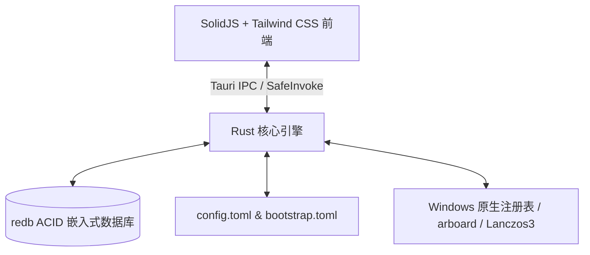

# TheBerry 🍓

<p align="center">
  <a href="https://BerryUIKI.github.io/TheBerry/"><strong>🌐 访问官方网站 (GitHub Pages)</strong></a>
  <br />
  <a href="README.md">English</a> | <a href="README_zh.md">简体中文</a>
</p>

<p align="center">
  <a href="https://BerryUIKI.github.io/TheBerry/"></a>
  <a href="https://github.com/BerryUIKI/TheBerry/actions/workflows/ci.yml"></a>
  <a href="https://github.com/BerryUIKI/TheBerry/actions/workflows/release.yml"></a>
  <a href="LICENSE"></a>
</p>

**TheBerry** 是一款极速、离线优先的个人桌面生产力工具套件。后端采用 **Tauri v2 + Rust** 构建，前端基于 **SolidJS + TypeScript + Tailwind CSS**。

---

## 🌟 核心功能套件

### 1. 🔍 全局 Spotlight 快捷搜索与启动面板 (`Ctrl + K`)
- 瞬间联合搜索启动器应用、剪贴板历史记录、代码片段及本地文件。
- 专属类别过滤标签（`@app`、`@clip`、`@snip`、`@file`）。
- 纯键盘工作流：`↑`/`↓` 导航、`Enter` 激活、`Ctrl+C` 复制路径、`Ctrl+E` 在资源管理器中打开、`Esc` 关闭。

### 2. 📋 富媒体剪贴板与 redb 深度检索
- 后台守护进程无缝捕获纯文本、URL 链接及屏幕截图。
- 实时 Base64 图像缩略图展示与全屏沉浸式缩放预览。
- 基于 redb 的深度全文索引，支持类型过滤（文本、图片、URL、JSON）与置顶锁定。
- 批量选择与一键清理模式。

### 3. 🚀 应用启动器与开始菜单扫描
- 自动扫描并索引 Windows 开始菜单快捷方式（`.lnk`）。
- 支持自定义执行参数、工作目录与多命令批量执行。

### 4. ⚡ 动态代码片段与实时预览
- 动态占位符模板自动展开：`${DATE}`、`${TIME}`、`${UUID}`、`${CLIPBOARD_TEXT}`。
- 编写代码片段时提供所见即所得的实时求值渲染预览。
- 支持 JSON 备份导出与批量导入恢复。

### 5. 🖼️ Lanczos3 图像转换器与优化预设
- 支持 PNG、JPEG、WebP 格式之间的批量高质量互转。
- 采用 Lanczos3 高保真重采样缩放算法，智能保持纵横比与画质调节。
- 提供 4 种一键预设（网页优化 WebP 80%、无损 PNG、缩略图 600px、移动端 1280px JPG）。
- 实时统计体积缩减量与存储节省百分比。

### 6. 📂 磁盘极速文件检索与 QuickLook 原生预览
- 多驱动器极速文件匹配，支持子字符串关键字实时高亮。
- 可排序表格列（文件名、大小、路径），支持一键在资源管理器中定位。
- 深度集成 Windows 原生 QuickLook 空格键实时预览，贯穿文件搜索、Spotlight 与图像处理。

### 7. 🔄 双向文件夹同步引擎
- 高性能文件夹同步，支持双向同步 (Two-way)、单向镜像 (Mirror) 与增量更新 (Update)。
- 差异比对引擎支持“时间戳 + 大小”快速比对与“SHA-256 加密内容哈希”深度比对。
- 实时文件系统变动监测与可调防抖机制。
- 安全删除保障：支持移动至回收站、时间戳版本归档或永久粉碎。

### 8. 🧰 开发者与生产力工具箱 (17/17 完整套件)
- **图像压缩器 (Image Compressor)**：多线程深度图像优化，支持 SIMD 编码、质量滑块、最大尺寸缩放与节省体积统计。
- **Markdown & 富文本互转 (Markdown & Rich Text)**：双向 Markdown ➔ HTML ➔ 纯文本转换，实时预览，一键复制富文本至 Word、Outlook 与微信。
- **Excel & CSV 表格转换 (Excel & CSV Sheets)**：支持 XLSX、XLS、CSV、TSV 极速互转，内置多工作表分页表格浏览器与 UTF-8 BOM 兼容。
- **PDF 组织器 (PDF Organizer)**：合并多个 PDF 文档并支持拖拽重排与逐页范围提取；支持单份 PDF 按页码范围切割提取。
- **PDF 转图像 (PDF to Images)**：高分辨率页面渲染（1x, 2x, 3x DPI 高清渲染），支持导出为 PNG、JPEG 与 WebP。
- **Windows 原生 OCR 与 AI 识图 (Windows Native OCR & AI Vision)**：基于 Windows 10/11 离线 OCR API (`Windows.Media.Ocr`)，支持剪贴板截图直接粘贴 (`Ctrl+V`)，并可一键桥接至 TheBerry AI 智能助手。
- **Word 转 PDF 转换器 (Word to PDF)**：通过 Windows Office 自动化批量静默将 `.docx` 和 `.doc` 转换为高质量 PDF。
- **文件加密哈希校验 (File Hash)**：多线程计算并校验 MD5、SHA-1、SHA-256、SHA-512 哈希指纹。
- **批量文件重命名 (Batch Renamer)**：支持正则表达式匹配替换、前缀/后缀、序号递增与实时对比预览。
- **二维码与条形码工具 (QR Code Tools)**：离线生成文本、网址、Wi-Fi 二维码，并支持从图片中识别二维码与条形码。
- **JSON & YAML 转换器 (JSON & YAML)**：结构化数据格式美化、双向转换与实时语法校验。
- **自定义卡片工作台 (Customizable Card Hub)**：支持分类视图与平铺网格视图，支持鼠标拖拽自由排序与右键固定至侧边栏。
- **100% 完整双语本地化 (Bilingual Localization)**：所有视图、弹窗、操作按钮、标签及 Toast 提示全量支持中英双语切换。

### 9. 🎨 自定义导航栏与三级收纳抽屉
- HTML5 拖拽重排侧边栏导航与工具箱卡片。
- 右键上下文菜单支持自定义工具别名、隐藏非高频工具或重置默认配置。
- 三级隐藏工具收纳：(1) 底部折叠收纳抽屉 (`+ N`)，(2) 工具箱置顶固定，(3) 全局导航管理器。

### 10. ⚡ 原生流式静默自动升级与系统服务
- Rust 原生 HTTP 流式下载器，直写 `<data_dir>/updates/`，无浏览器重定向及跨域限制。
- 实时下载进度条、已下载/总字节数与实时传输速率展示。
- 一键静默调用 NSIS 安装包 (`/S`)，优雅退出主进程并重新拉起，无需手动卸载重装。
- 原生 Windows 注册表 `Run` 键开机自启开关（无需 UAC 管理员提权）。
- 完整数据库与配置项 JSON 备份导出与导入恢复。
- 交互式快捷键速查备忘单（`?` / `F1`）。

---

## 🏗️ 技术架构



- **后端引擎**：[Rust](https://www.rust-lang.org/) + [Tauri v2](https://v2.tauri.app/)
- **前端界面**：[SolidJS](https://www.solidjs.com/) + [TypeScript](https://www.typescriptlang.org/) + [Vite](https://vite.dev/) + [Tailwind CSS](https://tailwindcss.com/)
- **数据持久化**：[redb](https://github.com/cberner/redb) 嵌入式事务型数据库 + TOML 配置文件
- **隐私与安全**：100% 纯本地离线运行，数据由用户完全掌控（默认位于 `<Documents>/BerryAppData`）。

---

## 🚀 快速上手与开发

### 环境准备
- Windows 10 (1903+) 或 Windows 11 (x64)
- Node.js (v20+) 与 [pnpm](https://pnpm.io/)
- [Rust & Cargo](https://www.rust-lang.org/tools/install) (1.78+)
- *(可选)* [QuickLook](https://github.com/QL-Win/QuickLook) 用于空格键原生文件快速预览

### 开发调试命令
```bash
# 安装依赖
pnpm install

# 运行前端单元测试
pnpm test

# 运行后端 Rust 测试
cargo test --manifest-path src-tauri/Cargo.toml

# 启动桌面端热更新开发模式
pnpm tauri dev

# 打包生产安装程序
pnpm tauri build
```

---

## 📖 架构设计文档与 ADR
- [系统架构总览 (Architecture Overview)](docs/architecture.md)
- [模块 IPC 通信接口 (Interfaces)](docs/interfaces.md)
- [里程碑 1 规划规范](docs/milestone-1.md)
- [里程碑 2 规划规范](docs/milestone-2.md)
- [里程碑 3 规划规范](docs/milestone-3.md)
- [ADR-0001: 架构选型与基础设计](docs/adr/ADR-0001-architecture-foundation.md)
- [ADR-0002: 持久层设计 (redb + TOML)](docs/adr/ADR-0002-persistence-redb-toml.md)
- [ADR-0003: 无边框窗口与系统托盘交互](docs/adr/ADR-0003-frameless-gui-and-tray.md)
- [ADR-0004: MVP 功能套件设计](docs/adr/ADR-0004-mvp-feature-suite.md)
- [ADR-0005: 离线隐私与安全防护](docs/adr/ADR-0005-offline-and-security.md)
- [ADR-0006: 界面美化、开机自启与深度检索](docs/adr/ADR-0006-gui-polish-autostart-and-deep-search.md)
- [ADR-0007: 统一数据库可移植性与 CI 自动化流水线](docs/adr/ADR-0007-full-backup-and-ci-pipeline.md)
