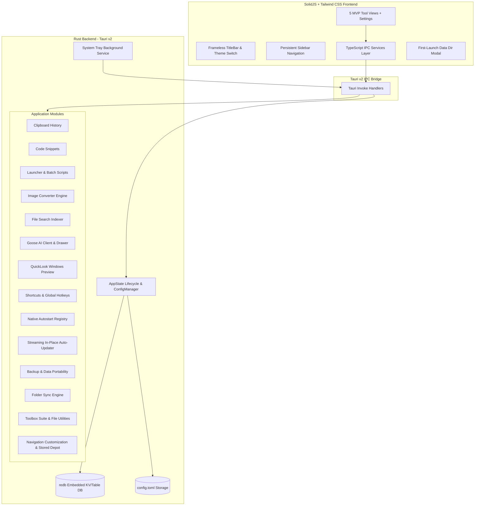

# TheBerry Architecture Document

## 1. Overview
**TheBerry** is a modular personal desktop utility suite designed for developers, designers, photographers, and content operators. It employs a high-performance **Rust (Tauri v2)** backend coupled with a reactive **SolidJS + TypeScript + Tailwind CSS** frontend.



---

## 2. Directory & Component Boundaries
- **`src/`**: SolidJS frontend codebase.
  - `components/layout/`: Title bar (`TitleBar.tsx`) and persistent navigation (`Sidebar.tsx`).
  - `components/setup/`: First launch data path setup modal (`FirstLaunchModal.tsx`).
  - `views/`: Dedicated views for each utility.
  - `services/`: Strongly-typed IPC invoke functions corresponding to backend commands.
  - `types/`: Shared TypeScript data models.
  - `context/`: Application state (`AppContext`) and theme management (`ThemeContext`).
- **`src-tauri/`**: Rust backend crate.
  - `src/core/`: Application lifecycle, path resolvers (`paths.rs`), `config.toml` manager (`config.rs`), and embedded `redb` database manager (`database.rs`).
  - `src/modules/`: Standalone implementations for each tool feature.
  - `src/commands/`: Tauri invoke command endpoints.
  - `src/tray.rs`: System tray icon, context menu, and background process lifecycle.

---

## 3. Data Storage & Persistence Model
### 3.1 Custom Root Directory Policy
- **No Tauri Default App-Data Path**: By design, TheBerry does not pollute hidden roaming app-data folders with primary user data.
- **Bootstrap Pointer**: On application launch, `ConfigManager` reads `~/.theberry/bootstrap.toml` to locate the custom root data directory.
- **First-Launch Wizard**: If uninitialized, the UI prompts the user to select or confirm the root data directory, with a default suggestion of `<Documents>/BerryAppData`.
- **Root Directory Layout**:
  ```text
  <User Selected Root>/BerryAppData/
  ├── config.toml           # Application settings (theme, tray, limits)
  ├── the_berry.redb        # Embedded redb database (zero-dependency ACID store)
  └── updates/              # Dedicated in-place update cache and temporary installer binaries
  ```

### 3.2 Database Engine: `redb`
`redb` is an embedded, ACID-compliant key-value/table database written entirely in Rust. Tables initialized across modules:
- `clipboard_history`: Keyed by UUID `&str`, stores serialized `ClipboardItem` JSON payloads.
- `snippets`: Keyed by UUID `&str`, stores `SnippetItem` JSON payloads.
- `launcher_items`: Keyed by UUID `&str`, stores `LauncherItem` JSON payloads.
- `sync_profiles`: Stores folder synchronization profiles (`SyncProfile`).
- `sync_history`: Stores synchronization execution logs and job manifests.
- `kv_store`: General key-value storage for metadata and module configurations.

---

## 4. Window & GUI Specifications
- **Frameless Window**: Window decorations are disabled (`decorations: false`). A custom drag region is enabled via `data-tauri-drag-region`.
- **Window Controls**: SolidJS custom header component handles Minimize, Maximize/Restore, and Close.
- **Close to Tray**: When `close_to_tray` is active in `config.toml`, closing the window hides it into the Windows system tray rather than terminating the process.
- **Theme Engine**: Real-time toggling between Light and Dark mode using Tailwind CSS `class` strategy with custom HSL color tokens.

---

## 5. Core & Extended Feature Modules
1. **Clipboard History Manager (`modules::clipboard`)**:
   - Stores copied text, previews, timestamps, and character counts.
   - Supports search filtering, pin-to-top, manual entry, item deletion, and clearing unpinned history.
2. **Developer Snippets Library (`modules::snippets`)**:
   - Stores code snippets, SQL queries, regexes, and templates.
   - Categorized by language, tags, and favorite status.
   - One-click copy and integrated editor.
3. **Application Launcher & Batch Organizer (`modules::launcher`)**:
   - Launches executables, scripts, or multi-command batch pipelines.
   - Tracks execution count and favorites with Windows Start Menu discovery.
4. **Batch Image Format Converter (`modules::image_converter`)**:
   - Converts image batches between PNG, JPEG, and WebP using high-fidelity Lanczos3 scaling.
   - Adjustable quality factors, presets, and destination directory control.
5. **Fast Local File Search (`modules::file_search`)**:
   - Fast directory traversal indexer and wildcard/substring search in Rust.
   - Real-time filtering by category (Files, Folders, Images, Code, Documents) and QuickLook spacebar previews.
6. **Folder Sync Engine (`modules::folder_sync`)**:
   - Multi-mode folder synchronization (Two-way, Mirror, Update, Custom) with time/size or SHA-256 hash comparison.
   - Real-time filesystem change monitoring and safe deletion handling (Recycle Bin, Versioning archive, or Permanent).
7. **Toolbox Suite & File Utilities (`modules::toolbox`)**:
   - Cryptographic file hash calculation (MD5, SHA1, SHA256, SHA512) with multi-threaded streaming chunks.
   - Batch file renamer with regular expressions, prefix/suffix rules, and live change previews.
8. **Native Streaming Auto-Updater & In-Place NSIS Overwrite (`modules::updater`)**:
   - Native Rust HTTP stream down to `<data_dir>/updates/` cache with live speed and progress metrics.
   - 1-click silent NSIS installer invocation (`/S`) followed by graceful main process termination and restart, eliminating manual uninstallation.
9. **Customizable Navigation & Three-Tier Stored Utilities Depot (`services::navigation`)**:
   - HTML5 drag-and-drop reordering for both the Sidebar navigation and the Toolbox utility card hub.
   - Right-click context menus for quick item renaming, custom aliases, hiding, or resetting.
   - Three-tier hidden items depot: (a) Sidebar collapsible "Stored Utilities" drawer, (b) Toolbox master depot with pin/unpin toggles, and (c) Navigation Manager modal.
