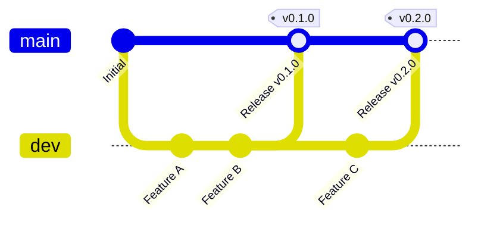

# Branch Protection & Release Pipeline Specification

## 1. Branch Strategy & Protection Policy

TheBerry follows a strict two-tier branch model:



- **`main` (Production Release Branch)**:
  - Protected against direct commits, force pushes (`allow_force_pushes: false`), and branch deletion (`allow_deletions: false`).
  - Code lands in `main` **only** by merging `dev` via approved pull requests when a release is cut.
  - Pushing or merging to `main`, publishing version tags (`v*`), or manual execution via `workflow_dispatch` triggers the automated multi-platform CI/CD release workflow (`release.yml`).
- **`dev` (Integration & Development Branch)**:
  - Daily feature branches (`codex/*`) merge into `dev` via focused, reviewable PRs after all test suites pass.

---

## 2. Multi-Platform Artifact Naming Convention

To allow stable download links on project websites and download managers without hardcoded version strings, GitHub Releases publishes artifacts following the unified naming pattern:

```text
<app_name>_<OS>_<architecture>.<extension>
```

### Canonical Artifact Matrix

| Platform | Architecture | Target Artifact Name | Package Format |
| :--- | :--- | :--- | :--- |
| **Windows** | x86_64 | `the-berry_windows_x64.msi` | Microsoft Installer |
| **Windows** | x86_64 | `the-berry_windows_x64.exe` | Standalone Installer / Portable |
| **Linux** | x86_64 | `the-berry_linux_x64.AppImage` | Universal AppImage |
| **Linux** | x86_64 | `the-berry_linux_x64.deb` | Debian / Ubuntu Package |
| **macOS** | Apple Silicon (ARM64) | `the-berry_macos_aarch64.dmg` | Apple Disk Image |
| **macOS** | Intel (x86_64) | `the-berry_macos_x64.dmg` | Apple Disk Image |

---

## 3. Automated Version Checking & Auto-Updates

- **Daily Silent Check**: The application performs a non-intrusive version query once per 24 hours against GitHub Releases (`https://api.github.com/repos/BerryUIKI/TheBerry/releases/latest`).
- **Notification**: If a higher semver version is available, the UI displays a clean banner. If up-to-date or offline, the check completes silently without disruption.
- **In-App Downloader**: The user can initiate a 1-click update that streams the platform-specific installer with real-time percentage progress and launches the update process.
