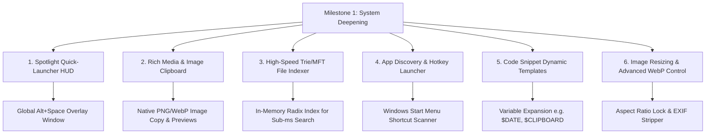

# Milestone 1 Product & Technical Specification

## 1. Overview & Objectives
Following the successful delivery and test validation of **Milestone 0** (Scaffolding, redb persistence, 5 MVP tools, and automated test harness), **Milestone 1** focuses on **System Deepening & Quick-Access Workflows**.

The primary objective of Milestone 1 is to evolve TheBerry from a dashboard utility into a **seamless system-level companion** with instant keyboard access, rich data handling, and accelerated indexing.

---

## 2. Milestone 1 Core Feature Themes

---

## 3. Detailed Work Breakdown

### 3.1 Global Quick-Launch HUD (Spotlight Bar)
- **Global Hotkey Registration**: Configurable hotkey (default: `Alt+Space` or `Ctrl+Shift+Space`) via `tauri-plugin-global-shortcut`.
- **Spotlight Floating Window**: Frameless, centered search popup that automatically focuses on keypress and closes on `Esc` or blur.
- **Unified Search Bar**: Instantly queries across all 5 modules simultaneously (Launcher apps, Clipboard items, Snippets, and recent files).

### 3.2 Rich Media Clipboard Manager
- **Image Clipboard Support**: Capture copied images (PNG, JPEG, screenshots) via `arboard::ImageData`, save thumbnail blobs into `<BerryAppData>/media/`, and display rich visual preview cards.
- **Direct Paste Action**: Pressing `Enter` on a clipboard item simulates an active window paste via native OS input synthesis.

### 3.3 Accelerated File Search & Indexing
- **In-Memory Prefix/Radix Indexer**: Background thread maintains a low-memory memory-mapped index of prioritized directories for instant `< 10ms` search responses.
- **Context Actions**: Right-click menu for files: "Open with...", "Copy as Path", "Reveal in Explorer", and "Properties".

### 3.4 Application Auto-Discovery & Custom Triggers
- **Start Menu `.lnk` Scanner**: Automatically scans `%APPDATA%\Microsoft\Windows\Start Menu\Programs` and `C:\ProgramData\Microsoft\Windows\Start Menu\Programs` to auto-populate installed software.
- **Custom Per-App Hotkeys**: Assign dedicated hotkeys (e.g. `F1`, `Alt+1`) to launch favorite tools or batch workflows directly.

### 3.5 Dynamic Snippet Templates
- **Template Variables**: Support placeholders like `${CURRENT_DATE}`, `${UUID}`, `${CLIPBOARD_TEXT}`, and tab-stop cursor placeholders `${1:default_value}`.
- **Monaco / CodeMirror Integration**: Syntax highlighting for 20+ programming languages directly inside the snippet viewer.

### 3.6 Batch Image Converter Enhancements
- **Drag-and-Drop Area**: Drag files or entire folders directly from Windows File Explorer into the converter view.
- **Resizing & Optimization**: Custom scaling (e.g., width/height limits, 50% scale), aspect ratio preservation, and metadata/EXIF stripping options.

---

## 4. Planned Architecture Decision Records (ADRs) for M1
- **ADR-0006**: Global Hotkey Management & Multi-Window Spotlight HUD Architecture
- **ADR-0007**: Rich Media Storage Strategy (Blob Files vs. Database Storage)
- **ADR-0008**: In-Memory Indexing Engine & Windows Start Menu Parser
