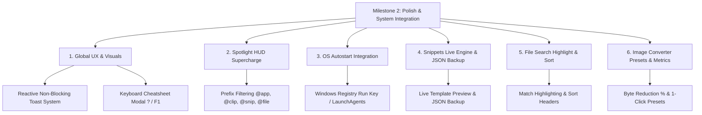

# Milestone 2 Product & Technical Specification

## 1. Overview & Objectives
Building upon the solid foundations of **Milestone 0** (Scaffolding & Architecture) and **Milestone 1** (Core Workflows, Rich Media Clipboard, Lanczos3 Image Processing, and Auto-updater), **Milestone 2** delivers:
1. **Polished Desktop User Experience & Visuals**: Non-blocking reactive Toast notifications, fluid view transitions, and an interactive keyboard shortcut cheatsheet modal.
2. **Global Spotlight HUD Power-Features**: Sub-module prefix filters (`@app`, `@clip`, `@snip`, `@file`), category tabs, and secondary keyboard workflows (`Ctrl+C`, `Ctrl+E`, `Esc` clearing).
3. **Deep Autostart on Boot Engine**: Cross-platform system startup integration (Windows Registry `Run` keys, macOS `LaunchAgents`, Linux `.desktop`).
4. **Snippet Dynamic Variable Live Preview & JSON Backups**: Real-time evaluation of `${DATE}`, `${UUID}`, etc., with bulk export/import.
5. **Image Processing Presets & Savings Summaries**: 1-click presets (WebP 80%, PNG Lossless, 600px Thumbnails) and exact byte reduction telemetry.
6. **File Search Sorting & Match Highlighting**: Instant multi-column sort and substring highlighting.

---

## 2. Milestone 2 Architecture Diagram

---

## 3. Registered IPC Commands Added in Milestone 2
| IPC Command | Module | Description |
|:--|:--|:--|
| `is_autostart_enabled` | `autostart` | Query whether the app is configured to launch on OS boot |
| `set_autostart` | `autostart` | Enable or disable system startup entry |
| `search_clipboard_history` | `clipboard` | Deep redb full-text search with content-type and pin filters |

---

## 4. Verification & Testing Matrix
- **Rust Backend Suite**: 18 tests across 7 test files (100% passing).
- **Frontend Vitest Suite**: 13 tests across 5 test files (100% passing).
- **Vite Production Build**: Clean bundle compilation without warnings or errors.
