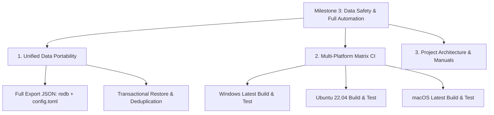

# Milestone 3 Product & Technical Specification

## 1. Overview & Objectives
With the completion of **Milestone 0** (Core Scaffolding & ADRs), **Milestone 1** (System Workflows & Media Clipboard), and **Milestone 2** (Spotlight Hub, Autostart Engine, UX Polish, and Website), **Milestone 3** delivers:
1. **Full Database & Config Data Portability Engine**: Complete JSON backup export and merge-restore for offline data safety across machines.
2. **Multi-Platform Continuous Integration Workflow (`ci.yml`)**: Automated build, test, and lint runner across Windows, Linux, and macOS.
3. **Comprehensive Developer Documentation & Architecture Specifications**: Full specifications, interface bindings, and updated project README.

---

## 2. Milestone 3 Architecture Diagram

---

## 3. Registered IPC Commands Added in Milestone 3
| IPC Command | Module | Description |
|:--|:--|:--|
| `export_full_backup` | `backup` | Generates pretty-printed JSON of all redb tables and config |
| `import_full_backup` | `backup` | Restores clipboard, snippets, launcher items, and preferences |

---

## 4. Verification Suite
- **Rust Backend Suite**: 20 tests across 9 test files (100% passing).
- **Frontend Vitest Suite**: 37 tests across 10 test files (100% passing).
- **Vite Production Build**: 0 errors, 0 warnings.
- **Cargo Clippy Linter**: integrated into CI matrix.
